# Panduan Penggunaan
## **Login dan Hak Akses**
1. Untuk memulai aplikasi anda bisa membuka browser dan masukan alamat berikut [`http://localhost/inventaris`](http://localhost/inventaris).
2. Muncul tampilan halaman login.
   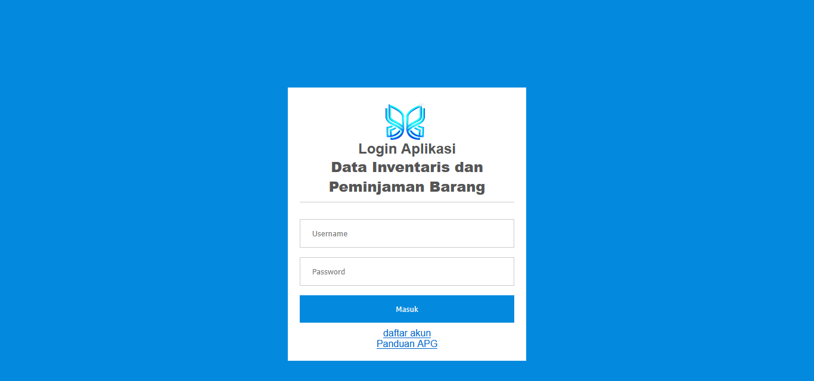
3. Masukan Username `admin` dan password `admin` untuk login sebagai administrator, lalu klik **login**. dan Masukan Username `user` dan password `user` untuk login sebagai peminjam
4. Selamat anda masuk ke halaman dashboard admin atau peminjam.
   
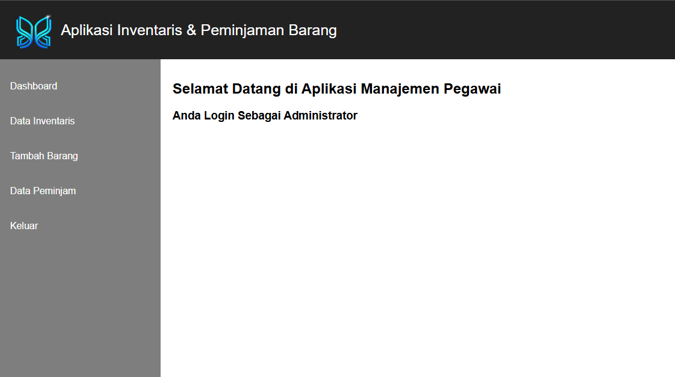
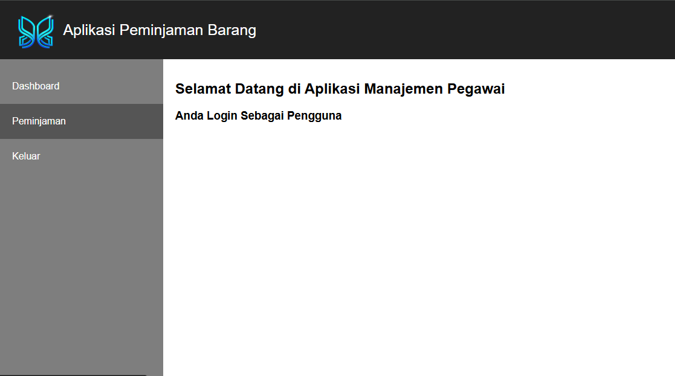

5. Untuk keluar anda bisa klik menu **keluar** pada sidebar.
   
##  **Dashboard admin** 

Didalam dasboard admin ada beberapa menu yaitu:
### 1. data inventaris
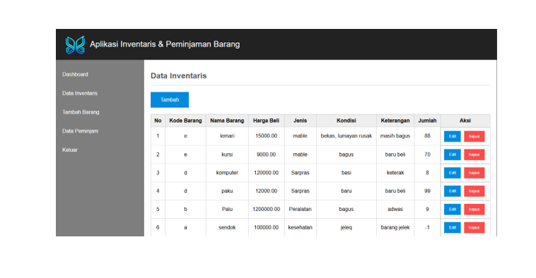

di data inventaris admin dapat mengedit, menambah, dan juga dapat menghapus.
### 2. Mengedit Data inventaris
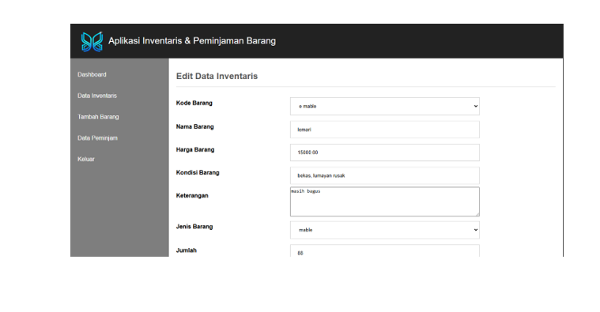

### 3. Menambah Data Inventaris
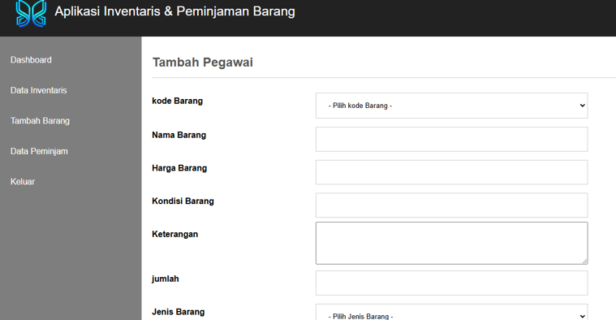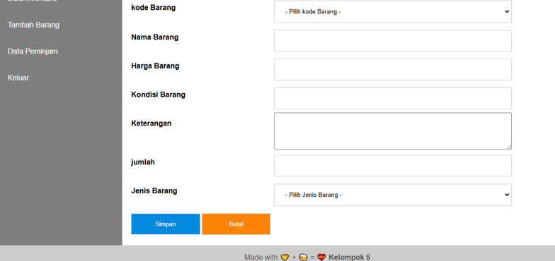

### 4. Menyimpan Data Inventaris
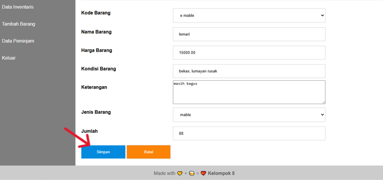

### 5. Menghapus Data Inventaris
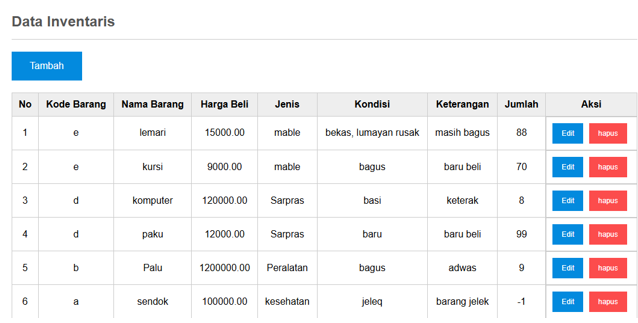

## **Didalam dasboard user / pengguna ada beberapa menu yaitu:**

### 1. data barang yang boleh di pinjam

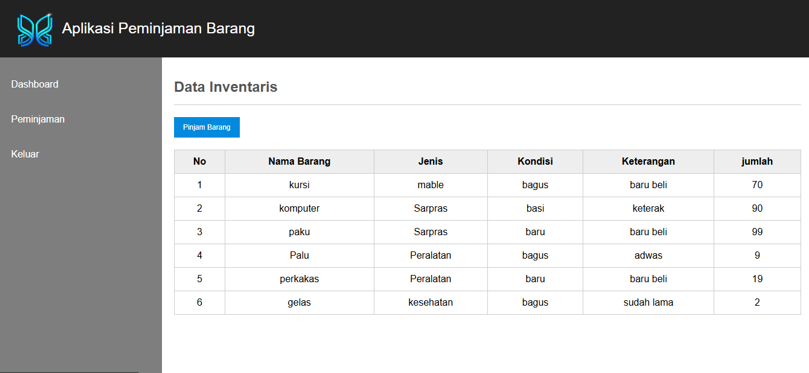

### 2. memilih barang yang akan di pinjam

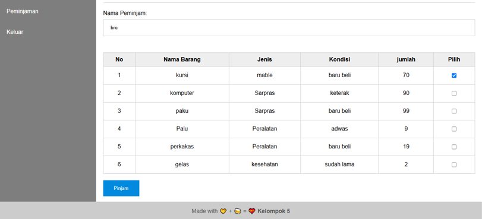

### 3. barang berhasil di pinjam

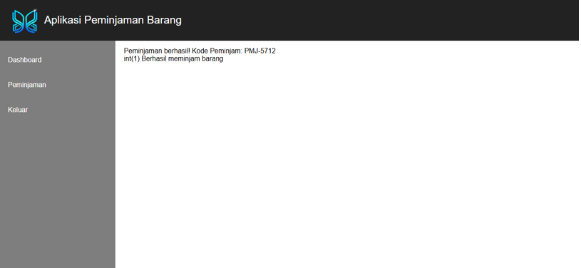